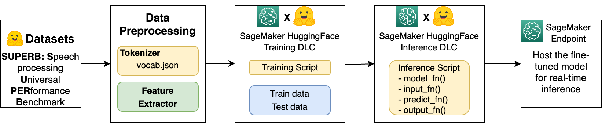

# wav2vec2-huggingface-sagemaker
**Fine-tune and deploy Wav2Vec2 model for speech recognition with HuggingFace and SageMaker**

In this repository, we use SUPERB dataset that available from Hugging Face [Datasets](https://huggingface.co/datasets/superb) library, and fine-tune the Wav2Vec2 model and deploy it as SageMaker endpoint for real-time inference for an ASR task. 

First of all, we show how to load and preprocess the SUPERB dataset in SageMaker environment in order to obtain tokenizer and feature extractor, which are required for fine-tuning the Wav2Vec2 model. Then we use SageMaker Script Mode for training and inference steps, that allows you to define and use custom training and inference scripts and SageMaker provides supported Hugging Face framework Docker containers. For more information about training and serving Hugging Face models on SageMaker, see Use [Hugging Face with Amazon SageMaker](https://docs.aws.amazon.com/sagemaker/latest/dg/hugging-face.html). This functionality is available through the development of Hugging Face [AWS Deep Learning Container (DLC)](https://docs.aws.amazon.com/deep-learning-containers/latest/devguide/what-is-dlc.html). 

This notebook is tested in both SageMaker Studio and SageMaker Notebook environments. Below shows detailed setup.   
- SageMaker Studio: **ml.m5.xlarge** instance with **Data Science** kernel.
- SageMaker Notebook: **ml.m5.xlarge** instance with **conda_python3** kernel. 

## Requirements

* sagemaker version: 2.78.0
* transformers version: 4.6.1
* datasets version: 1.18.4
* s3fs version: 2022.02.0
* pytorch version: 1.7.1
* jiwer
* soundfile

## Security

See [CONTRIBUTING](CONTRIBUTING.md#security-issue-notifications) for more information.

## License

This library is licensed under the MIT-0 License. See the LICENSE file.

